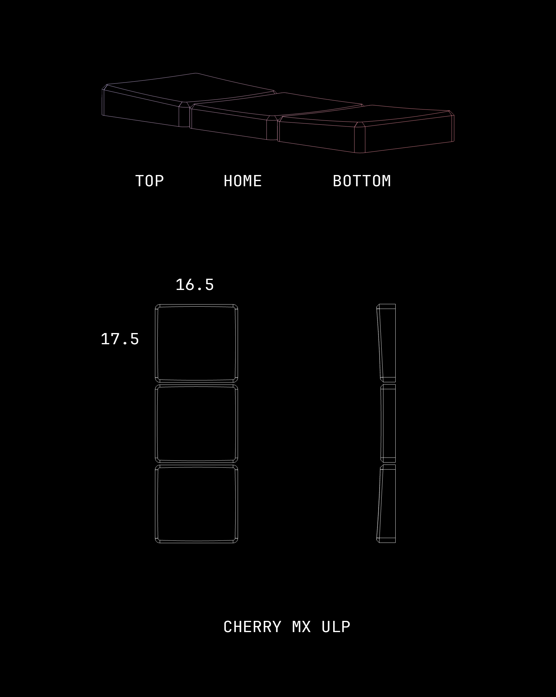
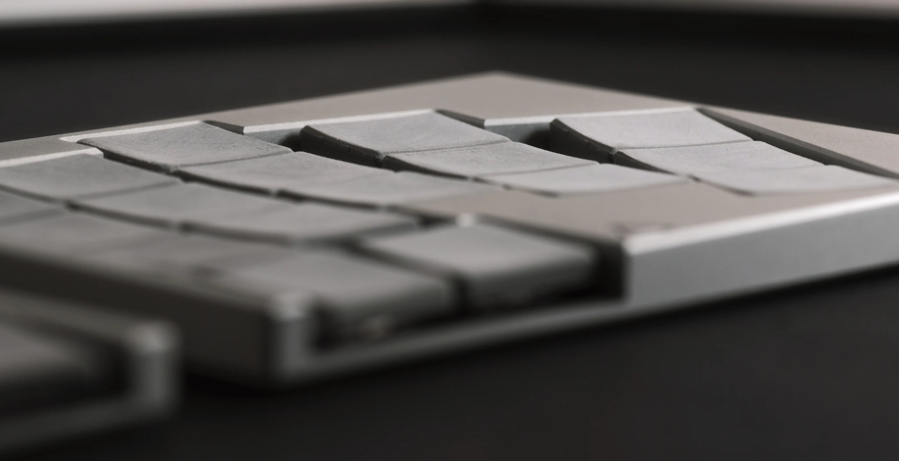

# delta ulp keycap

A 3deg tilted 17.5 x 16.5mm choc size ULP Keycap.

## Models

rev1 - increased height. about 2mm.

rev0 - After field testing, found some issues with the MJF printing. but not a big deal.

## TODO
- [ ] FDM Printing guide.

## License

[CERN-OHL-W-2.0](./LICENSE.md)
